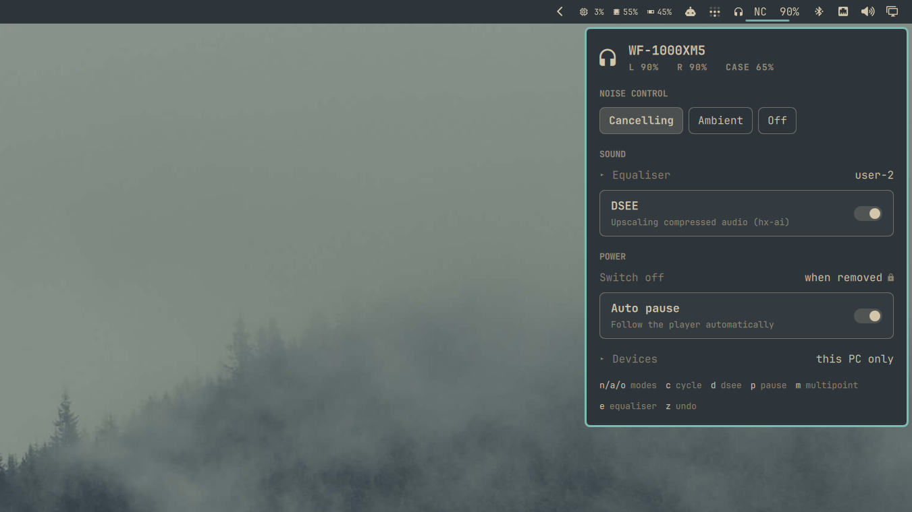

# Sony XM5 — headphone controls for the Omarchy bar

A bar widget for the **Sony WH-1000XM5** headphones and **WF-1000XM5**
earbuds. Battery in the bar, and a panel for noise control, the equaliser,
DSEE, auto pause and the headset's other connections.

Those two are the only devices this has been run against, and they are what
it claims to support. Other Sony models that speak MDR may well work — the
device is found by the service it offers rather than by a list of addresses,
and every control is gated on what that device says it has, so a model without
DSEE simply shows no DSEE. But "may well work" is not "tested", and only those
two have been.

Between those two there is nothing to configure. The daemon takes whichever
one is connected, so swapping headphones for earbuds needs nothing from you:
the panel retitles itself and shows the controls that pair actually has.

## What it shows

- **Battery** — per part, so earbuds report both buds and the case. The bar
  carries the emptier of the two you are wearing, which is the one that ends
  the listening.
- **Noise control** — cancelling, ambient, off, with the ambient level when it
  applies.
- **Sound** — the five-band equaliser with clear bass and an undo, and DSEE.
- **Power** — auto pause when you take them off.
- **Devices** — who else the headset is connected to, with disconnect and
  unpair.

Controls appear only for what the device advertises. A write to an endpoint a
device does not support is accepted, committed locally and never sent, so a
control that is always drawn would look like it worked and silently do nothing.

Three settings are shown but not offered — connection quality, the auto
power-off timer and the equaliser presets. Both XM5 models acknowledge those
commands and then keep the old value, which was established by writing them
and reconnecting to see what actually stuck. They carry a lock and say so on
hover, rather than pretending to be controls.

## Install

Two pieces. The bar widget cannot talk Bluetooth by itself: `mdrctld` owns the
headset's control session, because the device allows exactly one and the
handshake costs seconds.

**The daemon**, as an Arch package:

    git clone https://github.com/delarosa1312/omarchy-sony-xm5.git
    cd omarchy-sony-xm5
    makepkg --cleanbuild --install

That builds `libmdr` from [SonyHeadphonesClient][upstream] and installs
`mdrctl` and `mdrctld`. Packages do not start services on Arch, so turn them
on yourself -- the install prints this too:

    systemctl --user enable --now mdrctld mpris-proxy

That is the only install path, and it is enough: Omarchy is Arch, so everyone
who can install the widget already has `makepkg`. The package puts the daemon
in `/usr/bin` and its libraries in `/usr/lib/mdrctl`, which the user the
service runs as cannot write to -- a service that ran out of a checkout, or
out of anywhere under `$HOME`, would change what it executes every time you
pulled.

**The widget**:

    omarchy plugin add https://github.com/delarosa1312/omarchy-sony-xm5.git --enable

Same repository: `manifest.json` sits at its root, so the same clone serves
both. Installing the widget alone is not fatal and not silent -- it appears in
the bar with no readings and says what is missing when you click it.

[upstream]: https://github.com/mos9527/SonyHeadphonesClient

## What it needs

- `bluez`, and `bluez-utils` for `mpris-proxy` -- without it, pause-on-removal
  and the headset's transport buttons reach nothing at all
- `python` (no third-party modules)
- to build: `cmake`, `ninja`, a C++20 compiler, `git`, and the BlueZ and D-Bus
  development files

It runs nothing as root, opens no Bluetooth session from the panel, and starts
no second Quickshell process. The daemon talks to the panel over a unix socket
in `$XDG_RUNTIME_DIR`, in a directory systemd creates for it at mode 0700.

The daemon takes its settings as arguments -- `--mac`, `--build-dir`,
`--trace` -- and the unit clears the rest of the environment. It used to read
`MDR_BUILD`, `MDR_TRACE` and `MDR_MAC`, and `MDR_BUILD` chose which shared
objects it loaded, which meant anything able to set the environment of a
long-lived service chose the code it ran. See [docs/hardening.md](docs/hardening.md).

## Remove

The widget:

    omarchy plugin remove io.github.delarosa1312.sony-xm5

The daemon:

    systemctl --user disable --now mdrctld mpris-proxy
    sudo pacman -Rns mdrctl

Stop the services first so the headset's control session is handed back rather
than held until you log out.

## Place it on the bar

    omarchy bar move io.github.delarosa1312.sony-xm5 --section right
    omarchy bar move io.github.delarosa1312.sony-xm5 --before omarchy.bluetooth

## Use

Click the chip to open the panel; right-click cycles the noise mode without
opening anything. Scrolling the chip changes the ambient level, but only in
ambient mode, where the number means something.

In the panel: `n` `a` `o` pick a noise mode, `c` cycles, `d` toggles DSEE,
`p` auto pause, `m` multipoint, `e` opens the equaliser and `z` undoes it back
to what it was when the panel opened. Escape closes.

The equaliser is collapsed by default and its sliders ignore the scroll wheel,
because scrolling a panel past a slider used to commit every slider it passed.

## Optional: battery while the daemon is stopped

With `mdrctld` running, this configures itself. Without it, BlueZ still knows
the battery level — but not which of your devices to ask about, so give it the
address if you want a reading in that case:

    omarchy bar set io.github.delarosa1312.sony-xm5 mac AA:BB:CC:DD:EE:FF

or the same field under Setup > Plugins, where it is listed along with the
name the panel shows before the headset reports its own.

`bluetoothctl devices Connected` will tell you the address. Nothing else needs
it, and the panel ignores it entirely while the daemon is up.

## Under the hood

Why a daemon at all, what the device acknowledges and then ignores, and the
protocol notes behind every decision here: [docs/protocol.md](docs/protocol.md).

## Develop

    ./scripts/test        # daemon, panel logic, manifest, qmllint -- no headphones
    ./scripts/sync.sh     # the repo -> the installed plugin, and reload the shell

`qmllint` exits non-zero on any file containing an `IpcHandler`, Omarchy's own
`clock/BarWidget.qml` included, so only `Panel.qml` is linted.

## Tests

    ./scripts/test

`tests/test_mdrctl.py` covers the things that were wrong once: the equaliser's
two halves staged before a single commit, discovery picking a connected
MDR device and nothing else, a claimed value surviving the device's own late
echo of it, and which battery stands for a pair of earbuds.

`tests/model.test.js` covers the panel's own logic, which lives in
`Model.js` for exactly that reason -- extracting it immediately
turned up a bug where the earbud readings were printed in whatever order the
device answered in.

Neither needs headphones, BlueZ or libmdr, because none of those bugs were
hardware problems -- and none of them were visible in the panel either, which
is the point. The script also runs `omarchy plugin validate` and `qmllint`.

## What is inside

    manifest.json, *.qml, Model.js   the widget, at the root so one clone
                                     serves as the plugin
    daemon/                          mdrctl: the daemon that holds the
                                     headset's control session, its CLI, and
                                     the probing tools
    docs/protocol.md                 how this device family actually behaves
                                     on the wire, learned the hard way
    docs/hardening.md                what the daemon trusts, and what it
                                     stopped trusting
    PKGBUILD                         builds and installs the daemon

The daemon is a dependency of the widget, not the other way round. `mdrctl
status`, `mdrctl mode ambient` and the rest are useful on their own, with no
bar in sight -- but the packaging targets Arch, because Omarchy is Arch and
that is who this is for. Nothing in the daemon is Arch-specific if you want to
build it elsewhere; there is simply no script here that will do it for you.

## License

MIT. The upstream library it builds, [SonyHeadphonesClient][upstream], is MIT
too, and is not modified -- only a commit is pinned.

[upstream]: https://github.com/mos9527/SonyHeadphonesClient
