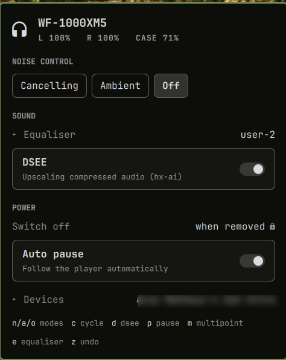

# Sony XM5 — headphone controls for the Omarchy bar

A bar widget for the **Sony WH-1000XM5** headphones and **WF-1000XM5**
earbuds. Battery in the bar, and a panel for noise control, the equaliser,
DSEE, auto pause and the headset's other connections.

Those two are the only devices this has been run against, and they are what
it claims to support. Other Sony models that speak MDR may well work — the
device is found by the service it offers rather than by a list of addresses,
and every control is gated on what that device says it has, so a model without
DSEE simply shows no DSEE. But "may well work" is not "tested", and only those
two have been.

Between those two there is nothing to configure. The daemon takes whichever
one is connected, so swapping headphones for earbuds needs nothing from you:
the panel retitles itself and shows the controls that pair actually has.

## What it shows

- **Battery** — per part, so earbuds report both buds and the case. The bar
  carries the emptier of the two you are wearing, which is the one that ends
  the listening.
- **Noise control** — cancelling, ambient, off, with the ambient level when it
  applies.
- **Sound** — the five-band equaliser with clear bass and an undo, and DSEE.
- **Power** — auto pause when you take them off.
- **Devices** — who else the headset is connected to, with disconnect and
  unpair.

Controls appear only for what the device advertises. A write to an endpoint a
device does not support is accepted, committed locally and never sent, so a
control that is always drawn would look like it worked and silently do nothing.

Three settings are shown but not offered — connection quality, the auto
power-off timer and the equaliser presets. Both XM5 models acknowledge those
commands and then keep the old value, which was established by writing them
and reconnecting to see what actually stuck. They carry a lock and say so on
hover, rather than pretending to be controls.

## Requires

This widget is a face for [**mdrctl**](https://github.com/delarosa1312/mdrctl),
which owns the Bluetooth session. Install that first: it builds `libmdr` and
installs a user service.

The panel talks to that daemon over a unix socket in `$XDG_RUNTIME_DIR`. It
runs no commands as root, opens no Bluetooth session of its own, and starts no
second Quickshell process. With the daemon stopped it falls back to the
battery level BlueZ already knows, and says that is all it has.

`mpris-proxy` must be running for pause-on-removal to reach your player; the
mdrctl install sets that up.

## Install

    omarchy plugin add https://github.com/delarosa1312/omarchy-sony-xm5.git --enable

## Place it on the bar

    omarchy bar move io.github.delarosa1312.sony-xm5 --section right
    omarchy bar move io.github.delarosa1312.sony-xm5 --before omarchy.bluetooth

## Use

Click the chip to open the panel; right-click cycles the noise mode without
opening anything. Scrolling the chip changes the ambient level, but only in
ambient mode, where the number means something.

In the panel: `n` `a` `o` pick a noise mode, `c` cycles, `d` toggles DSEE,
`p` auto pause, `m` multipoint, `e` opens the equaliser and `z` undoes it back
to what it was when the panel opened. Escape closes.

The equaliser is collapsed by default and its sliders ignore the scroll wheel,
because scrolling a panel past a slider used to commit every slider it passed.

## Optional: battery while the daemon is stopped

With `mdrctld` running, this configures itself. Without it, BlueZ still knows
the battery level — but not which of your devices to ask about, so give it the
address if you want a reading in that case:

    omarchy bar set io.github.delarosa1312.sony-xm5 mac AA:BB:CC:DD:EE:FF

`bluetoothctl devices Connected` will tell you the address. Nothing else needs
it, and the panel ignores it entirely while the daemon is up.

## Remove

    omarchy plugin remove io.github.delarosa1312.sony-xm5

## Develop

    ./scripts/test

Runs the daemon and protocol tests, the panel logic tests, `omarchy plugin
validate` and `qmllint`. None of it needs headphones.

`qmllint` exits non-zero on any file containing an `IpcHandler`, Omarchy's own
`clock/BarWidget.qml` included, so only `Panel.qml` is linted.

## License

MIT.
